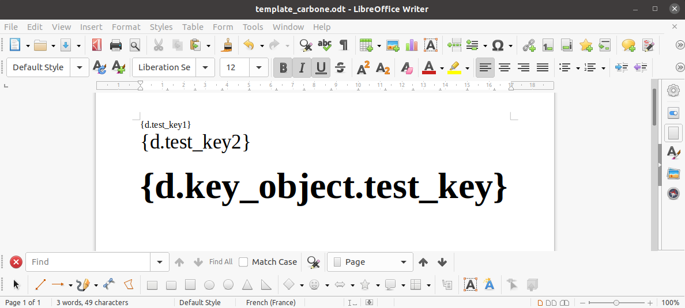

# Carbone Cloud API Java SDK

Based on API from [Carbone.io](https://carbone.io/api-reference.html)

## Install

With Maven add this to your project's pom.xml: 

```xml
<dependency>
    <groupId>com.tennaxia.carbone</groupId>
    <artifactId>carbone-sdk-java</artifactId>
    <version>1.0.0-RC1</version>
</dependency>
```

With Gradle :

```groovy
implementation 'com.tennaxia.carbone:carbone-sdk-java:1.0.0-RC1'
```

## Initialize API services

To initialize your services, you need to create an instance of `ICarboneServices` by using `CarboneServicesFactory`, passing your token key product and service's version (current is 4):

```java
ICarboneServices carboneServices = CarboneServicesFactory.CARBONE_SERVICES_FACTORY_INSTANCE.create(token, version);
```

You can also use your own instance of `ICarboneTemplateClient` and `ICarboneRenderClient`
```java
ICarboneServices carboneServices = CarboneServicesFactory.CARBONE_SERVICES_FACTORY_INSTANCE.create(carboneTemplateClient, carboneRenderClient);
```

## Usage

Now with the instantiated object you can use all carbone.io services:


### Upload template

You need to send the template file content in `byte[]`, it will return an `Optional` containing `templateId` if upload is successful.

```java
Path testFilePath = Paths.get("template_carbone.odt");
Optional<String> templateId = carboneServices.addTemplate(Files.readAllBytes(testFilePath));
```




### Render report

You can now render your report with a Json like object (refer to carbone.io documentation for syntax details):

```java
public class MyJsonObject {
    String test_key1;
    String test_key2;
    MyKeyObj key_object;

    public MyJsonObject(String test_key1, String test_key2, String inner_test_key) {
        this.test_key1 = test_key1;
        this.test_key2 = test_key2;
        this.key_object = new MyKeyObj(inner_test_key);
    }
    
    private static class MyKeyObj {
        String test_key;

        private MyInnerObj(String test_key) {
            this.test_key = test_key;
        }
    }
}
```

then calling render with template id:

```java
MyJsonObject jsonObj = new MyJsonObject("key one", "key two", "key three");
/**
 *  {
 *      test_key1: "key one",
 *      test_key2: "key two",
 *      key_object: {
 *          test_key: "key three"
 *      }
 **/

String renderId = carboneServices.renderReport(jsonObj, templateId.get());
```
By default, rendered report will be in PDF and with option `UseLosslessCompression` at false.
You can also call render with additional option for PDF rendering (see: [PDF export filter options](https://carbone.io/api-reference.html#pdf-export-filter-options)).
To do so, you need to add a `Map<String, Object>` to method call 

```java
Map<String, Object> additionalOptions = Map.ofEntries(
    Map.entry("UseLosslessCompression", true),
    Map.entry("DocumentOpenPassword", "password"),
    Map.entry("EncryptFile", true)
    );
String renderId = carboneServices.renderReport(jsonObj, templateId.get(), additionalOptions);
```

### Download report

You can now download your report:

```java
File outputFile = new File("report.pdf");

try (FileOutputStream outputStream = new FileOutputStream(outputFile)) {
    outputStream.write(carboneServices.getReport(renderId));
}
```

